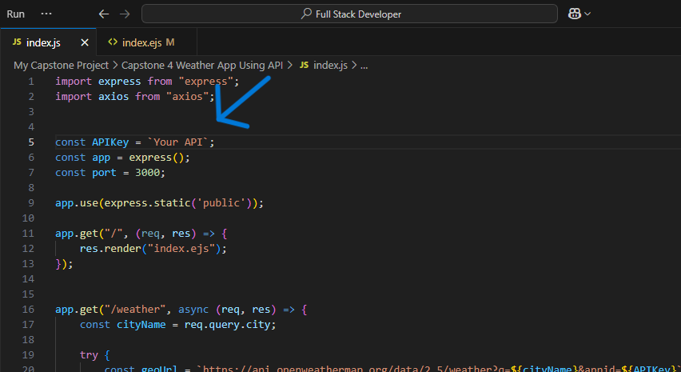

# ⛅ Weather App 🌧️🌞🌩️

A beautifully designed **Weather Forecast App** that brings real-time weather updates to your fingertips — complete with **clouds, sunshine, rain, and animations** to match your mood 🌤️🌧️⛈️.

> Built using **Node.js**, **Express**, **EJS**, and pure **Vanilla CSS** — no frameworks, just handcrafted weather vibes.

---

## 🌦️ Features

- 📍 Get **real-time weather** by entering any city name
- 🌍 Supports **global cities** with accurate data
- 🖼️ **Weather-themed animations** — clouds, rain, sunshine, and more
- 🎨 Aesthetic, expert-designed **weather UI** (no Bootstrap or Tailwind)
- 🌡️ Shows temperature, condition, humidity, wind speed
- ⚙️ Powered by a reliable **Weather API** (like OpenWeatherMap)

---

## 📸 Preview


> ☁️ See clouds move. 🌧️ Watch rain fall. 🌞 Let the sun shine — all within your browser.

---

## 🚀 Getting Started

### 1. Clone the repository

```bash
git clone https://github.com/ayushverma2909/weather-app.git
cd weather-app
npm install
```
> change your api key inside index.js <br>
> 
